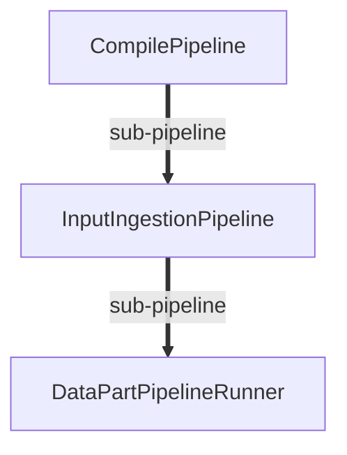

# Mode "Group by Item" - Structure Hiérarchique

## Problématique adressée

Dans l'architecture de ContextCompiler :
1. **CompilePipeline** exécute l'orchestration globale
2. **InputIngestionPipeline** s'exécute pour traiter les fichiers découverts
3. **DataPartPipelineRunner** s'exécute pour chaque "part" d'un fichier

Le diagramme doit refléter cette structure **hiérarchique à 3 niveaux** et montrer le **parcours complet de chaque fichier** à travers tous ses pipelines et phases.

## Structure obtenue avec "Group by Item"

```
CompilePipeline
├── Phase Setup
│   └── Événements
└── Phase InputIngestion
    └── Événements

InputIngestionPipeline (sub-pipeline du Global)
├── src/File1.cs (Item)
│   ├── Reading
│   │   ├── Started (Module: file-reader)
│   │   └── Completed (Module: file-reader, 50ms)
│   ├── Processing
│   │   ├── Started (Module: guard-module)
│   │   └── Completed (Module: guard-module, 10ms)
│   └── DataPartsProcessor
│       ├── Started (Module: pipelines.input-ingestion.datapart)
│       └── Completed (Module: pipelines.input-ingestion.datapart, 100ms)
│           └── DataPartPipelineRunner (sub-sub-pipeline)
│               ├── Part1
│               │   ├── Transform Started/Completed
│               │   └── Validate Started/Completed
│               └── Part2
│                   ├── Transform Started/Completed
│                   └── Validate Started/Completed
├── src/File2.cs (Item)
│   ├── Reading
│   │   ├── Started
│   │   └── Completed
│   ├── Processing
│   │   ├── Started
│   │   └── Completed
│   └── DataPartsProcessor
│       └── DataPartPipelineRunner (sub-sub-pipeline)
│           └── ...
└── src/File3.cs (Item)
    └── ...
```

## Liens de hiérarchie visualisés

Avec la checkbox "Show pipeline hierarchy links" cochée :



## Comparaison des modes

### Mode "Group by Item" (Nouveau, par défaut)

**Organisation** : Pipeline → Item → Phase → Événements

**Avantages** :
- ✅ **Parcours complet** : Montre tout le traitement d'un fichier spécifique
- ✅ **Structure logique** : Un bloc par fichier avec toutes ses phases
- ✅ **Sous-pipelines visibles** : DataPartPipelineRunner apparaît sous chaque fichier
- ✅ **Traçabilité** : Réponse directe à "Qu'est-il arrivé à File1.cs ?"
- ✅ **Debugging** : Facile d'isoler un fichier problématique

**Cas d'usage** :
- Tracer un fichier spécifique du début à la fin
- Débugger un fichier qui échoue
- Comprendre le workflow complet d'un item
- Visualiser les sous-pipelines par item

### Mode "Group by Phase" (Ancien comportement)

**Organisation** : Pipeline → Phase → Événements (tous les items mélangés)

**Avantages** :
- ✅ **Vue par étape** : Tous les fichiers dans une même phase
- ✅ **Comparaison** : Voir quels fichiers ont été traités ensemble
- ✅ **Analyse de phase** : Performance d'une phase spécifique
- ✅ **Statistiques** : Nombre total d'items par phase

**Cas d'usage** :
- Analyser la performance d'une phase spécifique
- Voir tous les items traités dans une étape
- Comparer le traitement entre items

## Implémentation technique

### JavaScript - Deux fonctions de génération

```javascript
// Nouveau mode : Group by Item
function generateDiagramGroupedByItem() {
    // 1. Grouper par Pipeline
    // 2. Pour chaque Pipeline, grouper par ItemId
    // 3. Pour chaque Item, grouper par PhaseId
    // 4. Générer les événements dans l'ordre chronologique
    
    // Structure : Pipeline → Item → Phase → Events
}

// Ancien mode : Group by Phase
function generateDiagramGroupedByPhase() {
    // 1. Grouper par Pipeline
    // 2. Pour chaque Pipeline, grouper par PhaseId
    // 3. Pour chaque Phase, lister tous les événements (tous items mélangés)
    
    // Structure : Pipeline → Phase → Events (avec ItemId dans le label)
}
```

### Données nécessaires (déjà disponibles)

```javascript
{
  Name: "PhaseStarted",
  PipelineId: "InputIngestionPipeline",         // Via RunContext.Pipeline.Id
  ParentPipelineId: "CompilePipeline",            // Via ISubPipelineRunContext
  PhaseId: "Reading",
  ModuleId: "file-reader",
  ItemId: "src/File1.cs",                        // ← Clé du groupement
  Timestamp: "2024-01-15T10:30:45.123Z",
  Duration: null,
  Error: null
}
```

## Exemple concret

### Scénario : Pipeline avec 3 fichiers

**Fichiers traités** :
- `src/Domain/User.cs`
- `src/Domain/Order.cs`
- `src/Infrastructure/Database.cs`

**Avec "Group by Item" ✅** :

```
InputIngestionPipeline
├── src/Domain/User.cs
│   ├── Reading: Started → Completed (50ms)
│   ├── Processing: Started → Completed (10ms)
│   └── DataPartsProcessor: Started → Completed (120ms)
│       └── DataPartPipelineRunner
│           ├── Part "Class User"
│           └── Part "Method Login"
├── src/Domain/Order.cs
│   ├── Reading: Started → Completed (45ms)
│   ├── Processing: Started → Completed (12ms)
│   └── DataPartsProcessor: Started → Completed (95ms)
│       └── DataPartPipelineRunner
│           ├── Part "Class Order"
│           └── Part "Method Create"
└── src/Infrastructure/Database.cs
    ├── Reading: Started → Completed (60ms)
    ├── Processing: Started → Completed (15ms)
    └── DataPartsProcessor: Started → Completed (200ms)
        └── DataPartPipelineRunner
            ├── Part "Class DbContext"
            ├── Part "Method Connect"
            └── Part "Method Query"
```

**Avantage visible** : On voit immédiatement que `Database.cs` prend plus de temps (200ms vs ~100ms) dans DataPartsProcessor, probablement car il a 3 parts au lieu de 2.

### Avec filtres

**Filtre sur "src/Domain/User.cs"** :
```
InputIngestionPipeline
└── src/Domain/User.cs
    ├── Reading: Started → Completed (50ms)
    ├── Processing: Started → Completed (10ms)
    └── DataPartsProcessor: Started → Completed (120ms)
        └── DataPartPipelineRunner
            ├── Part "Class User": Transform, Validate
            └── Part "Method Login": Transform, Validate
```

Le diagramme est **lisible et focalisé** !

## Bénéfices pour le debugging

### Scénario : Fichier qui échoue

1. Ouvrir `pipeline-report-interactive.html`
2. Cocher "Group by Item" (par défaut)
3. Filtrer sur le fichier problématique
4. **Vision complète** :
   - À quelle phase l'erreur survient ?
   - Quel module est responsable ?
   - Quel sous-pipeline (DataPartPipelineRunner) a échoué ?
   - Quelle "part" du fichier pose problème ?

### Scénario : Performance d'un fichier

1. Filtrer sur un fichier lent
2. Voir immédiatement :
   - Quelle phase prend le plus de temps ?
   - Combien de parts sont traitées ?
   - Durées de chaque étape

## Conclusion

Le mode **"Group by Item"** est maintenant le mode par défaut car il :
- ✅ Reflète la **structure hiérarchique réelle** du système
- ✅ Montre les **sous-pipelines** (DataPartPipelineRunner) à leur place logique
- ✅ Permet un **debugging efficace** fichier par fichier
- ✅ Répond à la question centrale : "Que s'est-il passé avec CE fichier ?"

Le mode "Group by Phase" reste disponible pour l'analyse de phases spécifiques.
