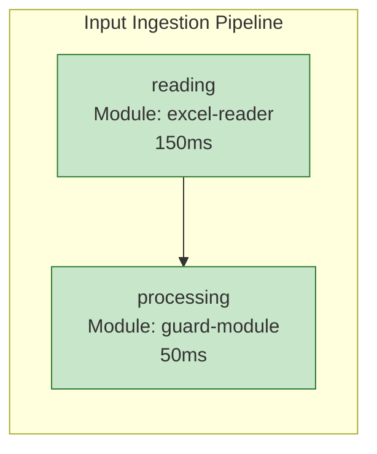

# ContextCompiler.Modules.Reports.Pipelines.Mermaid

Module qui génère un rapport visuel des pipelines sous forme de diagramme Mermaid avec un viewer HTML interactif.

## Fonctionnalités

- **Capture des événements de pipeline** : Intercepte automatiquement tous les événements de phase (Started, Completed, Failed)
- **Génération de diagrammes Mermaid** : Crée un graphique de flux représentant l'exécution du pipeline
- **Viewer HTML** : Génère une page HTML complète avec le diagramme Mermaid rendu
- **Code couleur** : Visualisation claire des états (démarré, complété, échoué)
- **Métriques de durée** : Affiche la durée d'exécution de chaque phase

## Installation

Ce module est un module global qui s'enregistre automatiquement lors du chargement.

```csharp
services.AddMermaidPipelineReportModule();
```

## Utilisation

Le module s'exécute automatiquement à la fin du pipeline global et génère un fichier `pipeline-report.html` dans le dossier de sortie.

### Artifact généré

- **Nom** : `pipeline-report.html`
- **Type** : Report
- **Contenu** : Page HTML avec diagramme Mermaid interactif

### Exemple de diagramme



## Légende des couleurs

- 🔵 **Bleu clair** : Phase démarrée
- 🟢 **Vert** : Phase complétée avec succès
- 🔴 **Rouge** : Phase échouée

## Architecture

### Composants principaux

1. **PipelineEventCollector** : Implémente `IPipelineEventHandler` pour capturer les événements
2. **MermaidHtmlGenerator** : Génère le HTML avec le diagramme Mermaid
3. **MermaidPipelineReportModule** : Module global qui orchestre la génération du rapport

### Flux d'exécution

1. Les événements de pipeline sont publiés par `PipelineEventPublisher`
2. `PipelineEventCollector` capture et stocke ces événements
3. À la fin du pipeline global, `MermaidPipelineReportModule` :
   - Récupère tous les événements collectés
   - Génère le diagramme Mermaid
   - Crée la page HTML
   - Enregistre l'artifact

## Configuration

Aucune configuration nécessaire. Le module fonctionne automatiquement.

## Dépendances

- `ContextCompiler.Modules.Abstractions` : Interfaces de base pour les modules
- `ContextCompiler.Abstractions` : Abstractions pour les événements et l'output

## Exemple de rapport généré

Le rapport HTML généré contient :
- Un titre
- Le diagramme Mermaid rendu
- Une légende explicative
- Un timestamp de génération

## Notes techniques

- Le diagramme est rendu côté client via le CDN Mermaid
- Les événements sont collectés de manière thread-safe
- Le module s'exécute avec une priorité de 900 (ArtifactGeneration)
