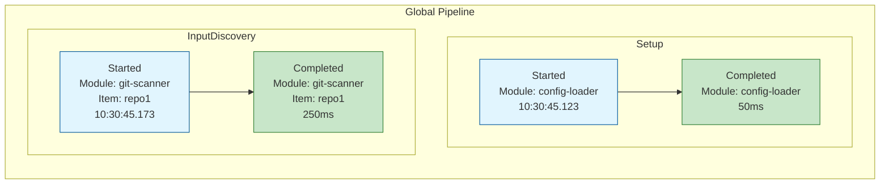
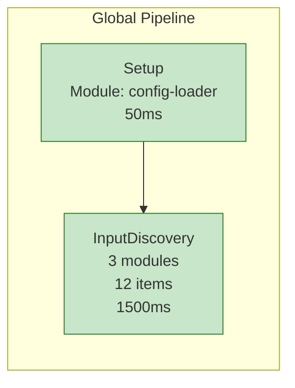

# ContextCompiler.Modules.Reports.Pipelines.Mermaid

Module qui génère des rapports visuels des pipelines sous forme de diagrammes Mermaid avec viewers HTML interactifs.

## Fonctionnalités

- **Capture des événements de pipeline** : Intercepte automatiquement tous les événements de phase (Started, Completed, Failed)
- **Vue Interactive avec filtres** ⭐ : Permet de filtrer dynamiquement par Pipeline, Phase, Module ou Item
- **Hiérarchie des pipelines** : Visualise les relations parent/enfant entre pipelines
- **Génération de diagrammes Mermaid** : Crée un graphique de flux représentant l'exécution du pipeline
- **Viewer HTML** : Génère des pages HTML complètes avec le diagramme Mermaid rendu
- **Code couleur** : Visualisation claire des états (démarré, complété, échoué)
- **Métriques de durée** : Affiche la durée d'exécution de chaque phase
- **Vue détaillée** : Affiche chaque événement individuellement avec les informations ModuleId et ItemId
- **Vue condensée** : Groupe les événements par phase pour réduire la complexité du diagramme
- **Support des diagrammes volumineux** : Configuration optimisée pour gérer de gros pipelines

## Installation

Ce module est un module global qui s'enregistre automatiquement lors du chargement.

```csharp
services.AddMermaidPipelineReportModule();
```

## Utilisation

Le module s'exécute automatiquement à la fin du pipeline global et génère **trois fichiers HTML** dans le dossier de sortie.

### Artifacts générés

Le module génère automatiquement trois rapports :

1. **pipeline-report-interactive.html** ⭐ RECOMMANDÉ : Vue interactive avec filtres dynamiques
   - **Filtres** : Pipeline, Phase, Module, Item
   - **Hiérarchie** : Visualise les liens parent/enfant entre pipelines (toggle activable)
   - **Diagramme dynamique** : Mis à jour en temps réel selon les filtres
   - **Compteurs** : Nombre total d'événements et nombre d'événements filtrés
   - **Résout le problème de lisibilité** : Permet de se concentrer sur une partie spécifique
   - Idéal pour l'exploration et le debugging interactif

2. **pipeline-report-detailed.html** : Vue détaillée montrant tous les événements individuellement
   - Affiche chaque événement Started/Completed/Failed
   - Inclut ModuleId et ItemId pour chaque événement
   - Montre les timestamps et durées précises
   - Idéal pour le debugging et l'analyse approfondie

3. **pipeline-report-condensed.html** : Vue condensée regroupant les événements par phase
   - Un nœud par phase avec statistiques agrégées
   - Nombre de modules et d'items traités
   - Durée totale par phase
   - Idéal pour une vue d'ensemble rapide

## Vue Interactive - Guide d'utilisation ⭐

### Filtres disponibles

La vue interactive offre 4 types de filtres combinables :

1. **Filtre Pipeline** : Sélectionner un pipeline spécifique
   - Utile quand plusieurs pipelines sont exécutés (global, sous-pipelines)
   - Permet de se concentrer sur un pipeline particulier

2. **Filtre Phase** : Se concentrer sur une phase spécifique
   - Exemples : Setup, InputDiscovery, InputIngestion, etc.
   - Idéal pour analyser une étape problématique

3. **Filtre Module** : Analyser l'exécution d'un module
   - Voir tous les événements générés par un module spécifique
   - Utile pour le debugging de modules

4. **Filtre Item** : Tracer le parcours d'un item
   - **Résout le problème de lisibilité !**
   - Sélectionner un fichier/item spécifique pour voir son parcours complet
   - Le diagramme devient vertical et lisible

### Hiérarchie des pipelines

La vue interactive affiche automatiquement les relations parent/enfant entre pipelines :

- **Détection automatique** via `ISubPipelineRunContext`
- **Liens visuels** : Flèches épaisses `==>|sub-pipeline|` entre parent et enfant
- **Toggle activable** : Checkbox "Show pipeline hierarchy links" pour activer/désactiver
- **Exemple** : 
  ```
  GlobalPipeline ==>|sub-pipeline| InputIngestionPipeline
  InputIngestionPipeline ==>|sub-pipeline| DataPartPipelineRunner
  ```

### Options d'affichage

La vue interactive offre plusieurs options pour personnaliser l'affichage :

#### Show Pipeline ID in labels

**Checkbox** : "Show Pipeline ID in labels (helps identify duplicates)"

Affiche le PipelineId dans les labels des événements pour identifier d'où ils proviennent.

**Utilité** :
- ✅ **Identifier les doublons** : Distinguer les événements qui semblent identiques
- ✅ **Comprendre les sources** : Voir si un événement vient du GlobalPipeline ou d'un sous-pipeline
- ✅ **Debugging** : Tracer l'origine exacte des événements

**Exemple** :
```
Sans option cochée :
  FileMatchTags Started
  Module: pass.filematchtags
  13:43:48

Avec option cochée :
  [InputIngestionPipeline]
  FileMatchTags Started
  Module: pass.filematchtags
  13:43:48
```

**Quand l'utiliser** :
- Si vous voyez des événements en double et voulez comprendre pourquoi
- Si un module semble s'exécuter plusieurs fois
- Pour identifier de quel niveau de la hiérarchie provient un événement

### Modes de groupement

La vue interactive offre **deux modes de visualisation** via la checkbox "Group by Item" :

#### Mode "Group by Item" (par défaut, recommandé)

Organise le diagramme par fichier/item, montrant le parcours complet de chaque item :

```
InputIngestionPipeline
├── src/File1.cs
│   ├── Reading Started/Completed
│   ├── Processing Started/Completed
│   └── DataPartProcessing Started/Completed
├── src/File2.cs
│   ├── Reading Started/Completed
│   ├── Processing Started/Completed
│   └── DataPartProcessing Started/Completed
└── src/File3.cs
    ├── Reading Started/Completed
    ├── Processing Started/Completed
    └── DataPartProcessing Started/Completed
```

**Avantages** :
- ✅ **Montre le parcours complet** de chaque fichier
- ✅ **Structure logique** : chaque item a son propre sous-graphe
- ✅ **Idéal pour tracer** : "Que s'est-il passé avec ce fichier ?"
- ✅ **Visualise les sous-pipelines** par item (ex: DataPartPipelineRunner pour chaque fichier)

#### Mode "Group by Phase" (ancien comportement)

Organise le diagramme par phase, regroupant tous les items dans chaque phase :

```
InputIngestionPipeline
├── Reading
│   ├── File1.cs Started/Completed
│   ├── File2.cs Started/Completed
│   └── File3.cs Started/Completed
├── Processing
│   ├── File1.cs Started/Completed
│   ├── File2.cs Started/Completed
│   └── File3.cs Started/Completed
└── DataPartProcessing
    ├── File1.cs Started/Completed
    ├── File2.cs Started/Completed
    └── File3.cs Started/Completed
```

**Avantages** :
- ✅ **Vue par étape** du pipeline
- ✅ **Comparaison facile** : voir tous les items dans une même phase
- ✅ **Analyse de phase** : "Quels items ont été traités dans cette phase ?"

### Cas d'usage typiques

#### 1. Tracer un item spécifique (RECOMMANDÉ)
```
Problème : Le diagramme est illisible car il y a 1000 fichiers traités
Solution :
1. Ouvrir pipeline-report-interactive.html
2. S'assurer que "Group by Item" est coché (par défaut)
3. Sélectionner un fichier dans le filtre "Item"
4. Cliquer "Apply Filters"
5. ✅ Le diagramme montre le parcours complet du fichier avec tous ses sous-pipelines
```

#### 2. Analyser une phase problématique
```
Problème : La phase InputIngestion est lente
Solution :
1. Décocher "Group by Item" pour passer en mode "Group by Phase"
2. Sélectionner "InputIngestion" dans le filtre "Phase"
3. Cliquer "Apply Filters"
4. Voir tous les items traités dans cette phase
```

#### 3. Débugger un module
```
Problème : Un module spécifique génère des erreurs
Solution :
1. Sélectionner le module dans le filtre "Module"
2. Cliquer "Apply Filters"
3. Voir tous les événements générés par ce module
```

#### 4. Comprendre la structure des pipelines et sous-pipelines
```
Objectif : Visualiser l'architecture complète (GlobalPipeline → InputIngestionPipeline → DataPartPipelineRunner)
Solution :
1. Cocher "Group by Item" (par défaut)
2. S'assurer que "Show pipeline hierarchy links" est coché
3. Les flèches épaisses montrent les relations parent→enfant entre pipelines
4. Chaque item montre ses sous-pipelines (ex: DataPartPipelineRunner)
```

#### 5. Voir le traitement des DataParts
```
Objectif : Comprendre comment les parties d'un fichier sont traitées
Solution :
1. Cocher "Group by Item"
2. Sélectionner un fichier dans le filtre "Item"
3. Le diagramme montre :
   - InputIngestionPipeline phases pour ce fichier
   - DataPartPipelineRunner sous-pipeline pour les parts de ce fichier
   - Toutes les phases de traitement des parts
```

#### 4. Comprendre la structure des pipelines
```
Objectif : Visualiser les sous-pipelines
Solution :
1. S'assurer que "Show pipeline hierarchy links" est coché
2. Les flèches épaisses montrent les relations parent→enfant
3. Décocher pour simplifier le diagramme si nécessaire
```

### Niveaux de détail

Le module supporte deux niveaux de détail :

#### Vue Détaillée (par défaut)

Affiche chaque événement individuellement avec :
- Le type d'événement (Started/Completed/Failed)
- Le ModuleId
- Le ItemId (si présent)
- Le timestamp ou la durée
- Les messages d'erreur (si failed)



#### Vue Condensée

Regroupe tous les événements d'une même phase en un seul nœud avec :
- Le nombre de modules exécutés
- Le nombre d'items traités
- La durée totale cumulée
- Le statut final



## Légende des couleurs

- 🔵 **Bleu clair** : Phase/Événement démarré(e)
- 🟢 **Vert** : Phase/Événement complété(e) avec succès
- 🔴 **Rouge** : Phase/Événement échoué(e)

## Architecture

### Composants principaux

1. **PipelineEventCollector** : Implémente `IPipelineEventHandler` pour capturer les événements et générer le diagramme
2. **MermaidHtmlGenerator** : Génère le HTML avec le diagramme Mermaid et la configuration optimisée
3. **MermaidPipelineReportModule** : Module global qui orchestre la génération du rapport
4. **MermaidDiagramOptions** : Options de configuration pour personnaliser la génération

### Flux d'exécution

1. Les événements de pipeline sont publiés par `PipelineEventPublisher`
2. `PipelineEventCollector` capture et stocke ces événements
3. À la fin du pipeline global, `MermaidPipelineReportModule` :
   - Récupère tous les événements collectés
   - Génère deux diagrammes Mermaid (détaillé et condensé)
   - Crée deux pages HTML avec configuration optimisée
   - Enregistre les deux artifacts

## Configuration

### Paramètres Mermaid

Le module configure automatiquement Mermaid avec les paramètres suivants :
- **maxTextSize** : 200 000 caractères (au lieu de 50 000 par défaut)
- **maxEdges** : 2 000 arêtes (au lieu de 500 par défaut)

Ces valeurs permettent de gérer des pipelines complexes avec de nombreux événements.

### Regroupement des événements (Vue Condensée)

Dans la vue condensée, le module regroupe intelligemment les événements par phase :
- Tous les événements d'une même phase sont consolidés en un seul nœud
- Le nombre de modules exécutés est affiché
- Le nombre d'items traités est affiché
- Les durées sont cumulées
- Le statut final (Started/Completed/Failed) est déterminé

Cela permet de réduire considérablement la taille du diagramme tout en conservant les informations essentielles.

### Événements détaillés (Vue Détaillée)

Dans la vue détaillée, chaque événement est affiché individuellement avec :
- **ModuleId** : Identifiant du module qui a généré l'événement
- **ItemId** : Identifiant de l'item traité (peut être vide pour le pipeline global)
- **Timestamp** : Horodatage précis de l'événement (HH:mm:ss.fff)
- **Duration** : Durée d'exécution pour les événements Completed
- **Exception** : Message d'erreur pour les événements Failed (tronqué à 50 caractères)

## Dépendances

- `ContextCompiler.Modules.Abstractions` : Interfaces de base pour les modules
- `ContextCompiler.Abstractions` : Abstractions pour les événements et l'output

## Exemples de rapports générés

### Rapport détaillé

Le rapport détaillé contient :
- Un titre avec indication "Detailed View"
- Une boîte d'information avec le nombre total d'événements
- Le diagramme Mermaid avec tous les événements individuels
- Des sous-graphes par pipeline et par phase
- Les connexions entre événements consécutifs
- Les connexions en pointillés entre phases
- Une légende explicative
- Un timestamp de génération

### Rapport condensé

Le rapport condensé contient :
- Un titre avec indication "Condensed View"
- Une boîte d'information avec le nombre total d'événements
- Le diagramme Mermaid avec un nœud par phase
- Les statistiques agrégées (modules, items, durée)
- Les connexions entre phases
- Une légende explicative
- Un timestamp de génération

## Notes techniques

- Le diagramme est rendu côté client via le CDN Mermaid v11
- Les événements sont collectés de manière thread-safe
- Le module s'exécute avec une priorité de 900 (ReportComposition)
- Deux rapports sont générés automatiquement (détaillé et condensé)
- Les limites Mermaid sont configurées pour supporter jusqu'à 200 000 caractères
- Les ItemId vides (pipeline global) sont gérés gracieusement

## Résolution des problèmes

### Erreur "Maximum text size in diagram exceeded" dans la vue détaillée

Cette erreur indique que le diagramme détaillé dépasse la limite de texte configurée. Les solutions :

1. **Recommandé** : Utiliser la vue condensée (`pipeline-report-condensed.html`) qui regroupe les événements par phase
2. **Augmenter les limites** : Modifier `maxTextSize` dans `MermaidHtmlGenerator.cs` (actuel : 200 000)
3. **Filtrer les événements** : Personnaliser `PipelineEventCollector` pour filtrer certains types d'événements
4. **Optimiser le pipeline** : Diviser le pipeline en sous-pipelines plus petits

### Diagramme trop dense

Si le diagramme détaillé est trop chargé :
- Consulter le rapport condensé pour une vue d'ensemble
- Les deux vues sont complémentaires : condensée pour la vue globale, détaillée pour le debugging
